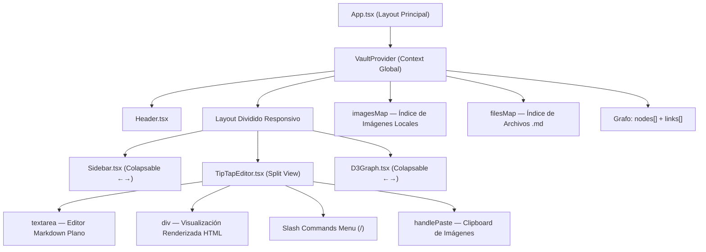
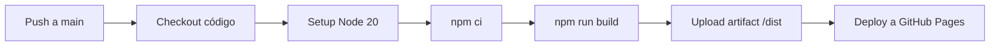

# Plan de Arquitectura: Personal Vault — Editor Local de Notas

Este documento describe la arquitectura completa de **Personal Vault**, una aplicación web local estilo Obsidian + Notion construida con **React, Vite y TypeScript**. Incluye instrucciones de instalación, despliegue y la arquitectura de componentes.

---

## Ecosistema de Librerías

| Librería | Versión | Propósito |
|---|---|---|
| **React** | 19.x | Framework de UI reactiva |
| **Vite** | 8.x | Empaquetador ultrarrápido con HMR |
| **TypeScript** | 6.x | Tipado estático |
| **Tailwind CSS** | 4.x | Utilidades CSS modernas |
| **D3.js** | 7.x | Grafo interactivo de conexiones entre notas (simulación de fuerzas) |
| **idb-keyval** | 6.x | Persistencia del `FileSystemDirectoryHandle` en IndexedDB |
| **Lucide React** | 1.x | Iconografía SVG premium |

> [!NOTE]
> **TipTap fue reemplazado** por un editor de texto plano (`<textarea>`) con panel dividido (Markdown crudo + visualización renderizada en tiempo real). Esto resolvió los problemas de interactividad de ProseMirror en modo edición y ofrece control total sobre el Markdown puro.

---

## Estructura del Proyecto

```
local-obsidian/
├── .github/
│   └── workflows/
│       └── deploy.yml            # GitHub Actions → GitHub Pages
├── public/
│   └── vite.svg
├── src/
│   ├── assets/
│   ├── components/
│   │   ├── D3Graph.tsx           # Grafo interactivo de conexiones (D3 force)
│   │   ├── Header.tsx            # Cabecera con logo y acciones de bóveda
│   │   ├── NewFileModal.tsx      # Modal para crear notas nuevas
│   │   ├── Sidebar.tsx           # Barra lateral colapsable de archivos
│   │   ├── TipTapEditor.tsx      # Editor dividido: Markdown plano + Preview
│   │   └── WelcomeScreen.tsx     # Pantalla de bienvenida inicial
│   ├── context/
│   │   └── VaultContext.tsx      # Contexto global: archivos, imágenes, grafo
│   ├── App.tsx                   # Layout principal con paneles colapsables
│   ├── App.css                   # Estilos del layout
│   ├── index.css                 # Estilos globales (scrollbar, ProseMirror)
│   └── main.tsx                  # Punto de entrada React
├── vanilla-prototype/            # Respaldo del prototipo Vanilla JS original
├── .gitignore
├── index.html                    # HTML base de Vite
├── package.json
├── tsconfig.json
├── tsconfig.app.json
├── tsconfig.node.json
└── vite.config.ts                # Config Vite + base path para GitHub Pages
```

---

## Arquitectura de Componentes



---

## Funcionalidades Implementadas

### Editor Dividido (Split View)
- **Panel Izquierdo**: `<textarea>` con Markdown crudo editable
- **Panel Derecho**: Renderizado HTML en tiempo real con soporte de:
  - Cabeceras `#`, `##`, `###`
  - Negritas `**texto**`
  - Listas `-` y listas de tareas `- [ ]` / `- [x]`
  - Bloques de código `` ``` ``
  - WikiLinks `[[Nota]]` interactivos y navegables
  - Imágenes incrustadas `![[imagen.png]]`

### WikiLinks Tolerantes
- Búsqueda insensible a mayúsculas/minúsculas y tildes (acentos)
- `[[Guía de Markdown]]` encuentra `Guia de Markdown.md`
- Si la nota no existe, ofrece crearla automáticamente

### Pegado de Imágenes desde Portapapeles
- `Ctrl + V` con un screenshot en el clipboard → guarda automáticamente `Pasted_image_<timestamp>.png` en la bóveda
- Inserta la sintaxis `![[Pasted_image_xxx.png]]` en la posición del cursor
- La imagen se renderiza visualmente en el panel derecho

### Slash Commands `/`
- Menú flotante con comandos: Título 1/2/3, Lista de Tareas, Negrita, Enlace, Fecha, Código
- Navegación con flechas ↑↓ y selección con Enter

### Barra Lateral Colapsable
- Botón circular para colapsar/expandir la barra de archivos
- Modo colapsado muestra solo iconos

### Grafo de Conexiones (D3)
- Simulación de fuerzas físicas con nodos arrastrables
- Indexación real de WikiLinks entre notas
- Panel colapsable con botón de alternancia

---

## Guía de Instalación en Otra PC

### Requisitos Previos

| Requisito | Versión Mínima | Comando de Verificación |
|---|---|---|
| **Node.js** | 18.x o superior | `node --version` |
| **npm** | 9.x o superior | `npm --version` |
| **Git** | Cualquiera | `git --version` |
| **Navegador** | Chrome 86+, Edge 86+ | (Necesario para File System Access API) |

> [!WARNING]
> **Firefox y Safari NO soportan la File System Access API.** La aplicación requiere un navegador basado en Chromium (Chrome, Edge, Brave, Arc) para la lectura/escritura de archivos locales.

### Pasos de Instalación

```bash
# 1. Clonar el repositorio
git clone https://github.com/emersondrw/local-obsidian.git
cd local-obsidian

# 2. Instalar dependencias
npm install

# 3. Levantar el servidor de desarrollo
npm run dev
```

La aplicación estará disponible en **`http://localhost:5173/local-obsidian/`**.

### Compilar para Producción

```bash
# Generar los archivos estáticos optimizados en /dist
npm run build

# Previsualizar la build de producción localmente
npm run preview
```

---

## Despliegue Automático con GitHub Actions → GitHub Pages

### Configuración del Repositorio en GitHub

1. Ve a **Settings → Pages** en tu repositorio de GitHub
2. En **Source**, selecciona **GitHub Actions**
3. ¡Listo! El workflow se ejecutará automáticamente en cada push a `main`

### Workflow: `.github/workflows/deploy.yml`

El pipeline hace lo siguiente en cada push a `main`:



### URL de Producción

Tras el primer deploy exitoso, la app estará disponible en:

```
https://emersondrw.github.io/local-obsidian/
```

> [!IMPORTANT]
> El `base` path en `vite.config.ts` está configurado como `/local-obsidian/` para que las rutas de assets funcionen correctamente en GitHub Pages. Si el nombre de tu repositorio es diferente, actualiza este valor.

### Comandos Git para Desplegar

```bash
# Desde la raíz del proyecto
git add .
git commit -m "feat: deploy initial version"
git push origin main
```

El workflow de GitHub Actions se disparará automáticamente y desplegará la aplicación en ~2 minutos.

---

## Verificación

### Automated Tests
1. `npm run build` — Verifica que TypeScript y Vite compilen sin errores.
2. `npm run lint` — Ejecuta OxLint para detectar problemas de estilo y lógica.

### Manual Verification
1. **Carga Inicial**: Ejecutar `npm run dev` → abrir `http://localhost:5173/local-obsidian/` → validar Dashboard de bienvenida
2. **File System**: Abrir bóveda local → verificar lista de archivos `.md` en Sidebar → cerrar pestaña → reabrir → confirmar restauración automática de sesión con permiso
3. **Editor Dividido**: Seleccionar nota → escribir Markdown en panel izquierdo → confirmar renderizado en tiempo real en panel derecho → guardar con `Ctrl + S`
4. **WikiLinks**: Escribir `[[Nota]]` → hacer clic en el enlace renderizado → confirmar navegación a la nota destino
5. **Pegado de Imágenes**: Capturar screenshot → `Ctrl + V` en el editor → confirmar inserción de `![[Pasted_image_xxx.png]]` y renderizado visual
6. **Slash Commands**: Escribir `/` → confirmar menú flotante → seleccionar un comando → confirmar inserción
7. **Grafo**: Verificar que los nodos representen las notas reales y los enlaces sean WikiLinks existentes → arrastrar nodos
8. **Paneles Colapsables**: Colapsar Sidebar → confirmar expansión del editor → colapsar Grafo → confirmar expansión del editor
