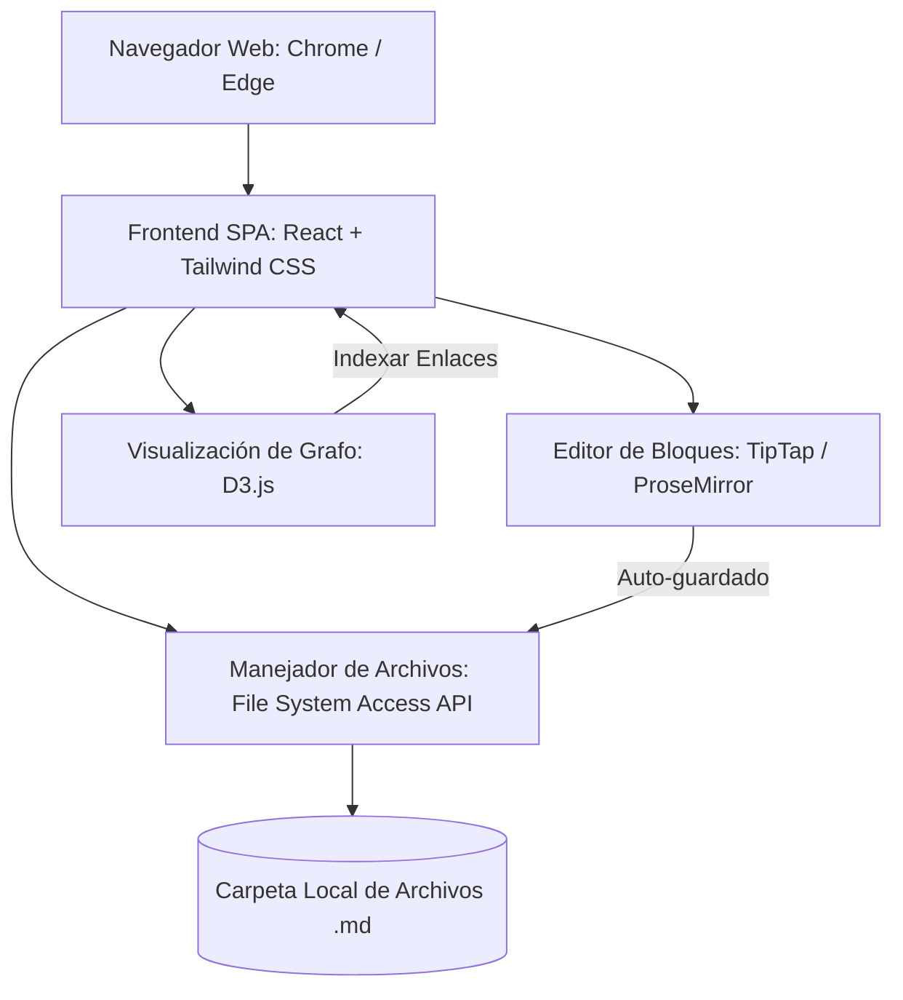

# Crear un Editor de Notas Local (Obsidian + Notion) sin Instalación

Propuesta de diseño y arquitectura para construir una aplicación de notas interactiva que funcione de manera 100% local, respetando las restricciones de instalación de software en computadoras corporativas y fusionando el control de archivos de Obsidian con la flexibilidad de bloques y bases de datos de Notion.

---

## User Review Required

> [!IMPORTANT]
> **Estrategia Anti-Bloqueo de IT:**
> Para evitar requerir permisos de administrador o instalaciones (como Electron o ejecutables .exe), la propuesta se basa en una **PWA (Progressive Web App) ejecutable directamente desde el navegador** (Chrome o Edge) utilizando la **File System Access API** de HTML5. Esta API permite que una página web local lea y escriba directamente en una carpeta del disco duro del usuario (tu "Vault" de archivos Markdown) con consentimiento explícito, eliminando la necesidad de un servidor backend o de instalar ejecutables.

> [!TIP]
> **Formato de Datos:**
> Mantendremos el estándar de **Markdown (.md)** con metadatos en **YAML Frontmatter** para que tus notas sigan siendo 100% tuyas y legibles por cualquier otro editor en el futuro (portabilidad total).

---

## Alternativas de Stack Tecnológico: ¿Es React + Tailwind la mejor opción?

Para este caso de uso específico (aplicación local sin instalación), evaluamos el stack propuesto frente a alternativas viables:

### 1. Frontend Framework: React vs. Svelte vs. Vanilla JS

| Tecnología | Pros | Contras | Recomendación |
| :--- | :--- | :--- | :--- |
| **React** | - Wrapper nativo para editores de bloques (`TipTap`, `Lexical`).<br>- Ecosistema robusto para gráficos interactivos (`D3.js` o `React Flow`). | - Requiere obligatoriamente compilar (`npm run build`) para ejecutarse.<br>- Mayor tamaño de bundle. | **Recomendado si puedes instalar Node.js** en tu entorno local para el desarrollo inicial. |
| **Svelte** | - Extremadamente rápido y reactivo.<br>- Genera código final muy ligero sin Virtual DOM. | - Menor ecosistema de componentes listos para editores de bloques complejos. | Excelente opción intermedia si quieres un código más limpio y eficiente que React. |
| **Vanilla JS** | - Cero herramientas de build.<br>- Se puede ejecutar haciendo doble clic en un único archivo `index.html`. | - Mantener el estado sincronizado (editor, grafo, explorador de archivos, bases de datos) se vuelve sumamente complejo y difícil de mantener. | Solo recomendado si tienes **bloqueado al 100% Node.js / npm** en la PC corporativa. |

### 2. Estilos: Tailwind CSS vs. CSS Vanilla (Moderno)

* **Tailwind CSS:** Es ideal si quieres construir rápido componentes complejos (modales, barras laterales, tablas interactivas) con un diseño visual consistente. Sin embargo, requiere un compilador para procesar las clases de utilidad.
* **CSS Vanilla (Variables y Grid/Flexbox):** En navegadores modernos (Chrome/Edge), CSS nativo ofrece soporte completo para variables (`--primary-color`), Grid, Flexbox y animaciones. Para un proyecto offline sin dependencias, **escribir CSS nativo limpio es una opción sumamente fuerte** porque elimina la necesidad de compilar estilos y funciona de inmediato en cualquier lado.

---

## Open Questions

1. **¿Qué tan estricta es la PC de la empresa con respecto al uso de Node.js?**
   - Si tienes permitido ejecutar Node.js en la terminal (PowerShell/CMD), podemos construir una SPA de React/Vite que corra localmente en un puerto (`http://localhost:5173`).
   - Si Node.js está completamente bloqueado, el proyecto puede diseñarse para ejecutarse abriendo directamente un archivo `index.html` compilado (Vanilla JS o distribución estática) en el navegador.

2. **¿Cuál es tu prioridad visual y funcional?**
   - ¿Prefieres dar prioridad al **Graph View** (vista de grafo tridimensional/2D de Obsidian) o a las **Bases de Datos con filtros y vistas Kanban** (tipo Notion)?

---

## Proposed Changes

A continuación se detalla la arquitectura propuesta del software, dividida por módulos clave:



### 1. Motor de Persistencia (File System Access API)
Para conectarse directamente al sistema de archivos local de Windows sin usar servidores intermedios:
- **Tecnología:** `showDirectoryPicker()` de HTML5.
- **Flujo:** Al iniciar la app, seleccionas tu carpeta local de notas. El navegador te pedirá permiso de lectura y escritura. A partir de ahí, la app tiene acceso al árbol de archivos Markdown para leerlos, crearlos, modificarlos y eliminarlos en tiempo real.

### 2. Editor Híbrido (Mejor que Obsidian, Estilo Notion)
El mayor fuerte de Notion es su editor de bloques interactivos y su comando `/` (slash commands).
- **Tecnología recomendada:** [TipTap](https://tiptap.dev/) (construido sobre ProseMirror) o [Lexical](https://lexical.dev/) (de Meta).
- **Características:**
  - Edición WYSIWYG real por bloques (párrafo, tareas, código, tablas, listas).
  - Menú flotante al escribir `/` para insertar bloques rápidamente.
  - Generación de Markdown en tiempo real al guardar el archivo.
  - Autocompletado de enlaces bidireccionales al escribir `[[` para conectar notas.

### 3. Bases de Datos Estructuradas (Estilo Notion en Markdown)
En Obsidian, para tener bases de datos visuales requieres instalar plugins complejos como *Dataview* y *Projects*. Lo haremos nativo en tu app local:
- **Estructura:** Cada nota de Markdown tendrá un encabezado YAML Frontmatter:
  ```markdown
  ---
  title: Plan de Proyecto
  status: En Progreso
  priority: Alta
  tags: [trabajo, desarrollo]
  due_date: 2026-07-15
  ---
  # Plan de Proyecto
  Detalles de la tarea aquí...
  ```
- **Visualización:** La aplicación escaneará los archivos `.md` de la carpeta seleccionada, leerá el YAML superior de cada uno y te permitirá renderizar tablas dinámicas, tableros Kanban (agrupados por `status`) o listas de tareas, permitiendo editar las propiedades directamente desde la interfaz gráfica y actualizando el YAML en el archivo original de forma transparente.

### 4. Vista de Grafo (Graph View de Obsidian)
- **Tecnología:** [D3.js](https://d3js.org/) (Force-directed Graph) o [vis.js](https://visjs.org/).
- **Flujo:** Un indexador en memoria analizará todas las notas abiertas buscando referencias del tipo `[[Nombre de Nota]]`. Creará un mapa de nodos y aristas (enlaces) y lo dibujará de forma interactiva en 2D con animaciones suaves de física y zoom. Al hacer clic en un nodo del grafo, se abrirá la nota en el editor.

### 5. Estética Premium e Interfaz de Usuario
- **Tecnología:** Tailwind CSS v3/v4 con soporte nativo de Dark Mode.
- **Componentes:** Lucide React para iconografía moderna.
- **Detalles Premium:**
  - Glassmorphism en paneles laterales de navegación y propiedades de Notion.
  - Micro-animaciones al reorganizar bloques o abrir el grafo.
  - Paletas de colores curadas en HSL (Slate, Emerald, Violet) en lugar de colores primarios simples.

---

## Verification Plan

### Verificación de Viabilidad Técnica
1. **Acceso al disco duro:** Probar en la PC corporativa con un prototipo rápido de 10 líneas de JavaScript en la consola del navegador que use `showDirectoryPicker()` para verificar que la directiva de seguridad del navegador no esté restringida por políticas de IT del dominio corporativo.
2. **Compatibilidad offline:** Validar el registro de Service Workers si se desea correr como PWA offline sin levantar ningún servidor de desarrollo local.
